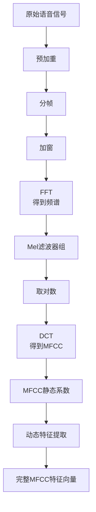

MFCC（Mel-Frequency Cepstral Coefficients，梅尔频率倒谱系数）本质是一种**给声音“做身份证”的技术**——它能把复杂的声音信号，提炼成一串简单的数字，让电脑能像人耳一样“看懂”声音的关键特征（比如区分“你好”和“再见”，或识别猫叫和狗叫）。

它的核心思路很简单：**模仿人耳听声音的习惯**，只提取人耳真正在乎的信息，扔掉没用的“杂音”。下面用生活场景类比，一步步讲清原理：


### 第一步：把声音“切小块”——分帧加窗
声音是“随时间变化的振动”（比如你说话时，每秒声音的高低、大小都在变），如果直接处理整段声音，电脑会“看不过来”。  
就像看电影不能一次性看2小时的“连续画面”，得切成一帧一帧（比如每秒24帧），每帧单独分析。声音也一样：
- **分帧**：把整段声音切成“小片段”（比如每段20毫秒，相邻片段重叠一点，避免漏信息），每一段叫一“帧”。
- **加窗**：给每帧声音加个“渐变效果”——让帧的开头慢慢变大、结尾慢慢变小，避免帧与帧之间的“突兀切换”（比如突然静音或突然变响），减少杂音干扰。

这一步的目的：把“动态的声音”变成“静态的小片段”，方便后续分析。


### 第二步：把声音“拆成音调”——时域转频域（傅里叶变换）
人耳听声音，不是听“振动的快慢”，而是听“音调高低”（比如高音、低音）和“音量大小”。但声音的原始信号（叫“时域信号”）是“随时间波动的曲线”，比如下图这样，看起来乱糟糟的，看不出音调：  

这时候需要一个“魔法”——**傅里叶变换**，它能把“时域信号”转成“频域信号”：  
就像把一杯“混合果汁”（比如橙汁+苹果汁+西瓜汁）拆成“每种果汁的比例和多少”，声音也会被拆成“不同频率（音调）的声音，各自有多响”。  
转完后会得到“频谱图”：横轴是频率（音调高低，比如100Hz是低音，1000Hz是中音），纵轴是能量（音量大小，值越大越响）。比如你说“啊”，频谱图上会显示“中低频的能量很高，高频能量低”——这就是“啊”的音调特征。

这一步的目的：从“看时间波动”变成“看音调分布”，贴合人耳对“音调”的感知。


### 第三步：模仿人耳“挑重点”——梅尔滤波器组
人耳对不同频率的敏感度是不一样的：  
- 对**中高频**（比如人说话的频率，200-4000Hz）特别敏感（比如能区分“你”和“我”的细微音调差）；  
- 对**极低频**（比如地震的轰隆声，<50Hz）和**极高频**（比如蝙蝠的超声波，>20000Hz）不敏感，甚至听不到。

MFCC用“**梅尔滤波器组**”来模拟这种敏感度——它就像一组“定制的滤网”：
- 只保留人耳敏感的频率段（比如200-4000Hz），过滤掉极低频和极高频；  
- 敏感的频率段（比如中高频），滤网分得细（能区分细微差异）；不敏感的段，滤网分得粗（忽略小差异）。

具体操作：把第二步得到的“频谱”，用这组滤网“扫一遍”——每个滤网会算出自己覆盖的频率段里的“总能量”（比如“200-500Hz段的总音量”“500-1000Hz段的总音量”）。最后会得到一串“能量值”，比如10个滤网就得到10个能量值。

这一步的目的：只留“人耳在乎的信息”，扔掉无用频率，大大简化数据。


### 第四步：贴合人耳“听音量”的习惯——对数运算
人耳对“音量”的感知不是“线性”的，而是“对数”的：  
比如声音的实际能量翻10倍，人耳只觉得“音量大了一点”；翻100倍，才觉得“音量大了不少”。如果直接用第三步的“能量值”，电脑会误以为“能量翻10倍=音量翻10倍”，和人耳感知脱节。

所以要做“对数运算”：把每个滤网的“能量值”换成“对数能量值”。比如能量是10，对数后是1；能量是100，对数后是2——这样就和人耳“听音量”的感觉一致了。


### 第五步：“压缩数据”提关键——离散余弦变换（DCT）
经过第四步，我们有了一串“对数能量值”（比如10个），但这些值之间可能有“重复信息”：比如相邻两个滤网的能量值很接近（比如“500-1000Hz”和“1000-1500Hz”的音量差不多），相当于有“废话”。

这时候用“**离散余弦变换（DCT）** ”来“压缩”：它就像把一篇文章“提炼关键词”——去掉重复的句子，只留下最核心的几个词。比如把10个能量值，压缩成3-13个“系数”（这些系数就是MFCC的核心）。

为什么叫“倒谱”？因为DCT处理后的数据，不再是“频率域”的信息，而是“频率的频率”（叫“倒频域”），所以这些系数叫“倒谱系数”。


### 最后：可选但重要——动态特征（Delta）
人耳听声音，不仅在乎“当前帧的音调”，还在乎“音调的变化”：比如“你好”的“你”到“好”，音调是慢慢变的；如果音调突然跳变，可能是噪音。

所以实际用MFCC时，还会算“动态特征”：比如“当前帧的MFCC”和“前一帧、后一帧的MFCC的差值”（叫Delta系数），甚至“差值的差值”（叫Delta-Delta系数）。这样得到的特征更完整，电脑识别声音更准。


### 总结：MFCC的核心逻辑
一句话概括：**模仿人耳的“听感”，把复杂的声音信号，一步步简化成一串关键数字**——从“切小块”→“拆音调”→“挑人耳在乎的频率”→“贴合听音量的习惯”→“提核心信息”，最终得到的“数字串”就是MFCC。

它的用处特别广：语音识别（比如 Siri 听懂你说话）、声音分类（比如区分哭声和笑声）、音乐检索（比如搜“和这首歌风格像的歌”），背后都离不开MFCC给声音做的“身份证”。

好的，我将详细介绍 MFCC（Mel-Frequency Cepstral Coefficients），这是语音信号处理中**最经典、最重要的特征之一**。

# MFCC 详细介绍

## 1. MFCC 的基本概念

**MFCC** 是在 Mel 频谱基础上进一步处理得到的特征，它通过**倒谱分析**来分离声源和声道信息。

### 核心思想
- **声源-声道分离**：语音 = 声带激励（源） × 声道特性（滤波器）
- **MFCC 的目标**：提取代表声道形状的特征，抑制声源的影响

## 2. MFCC 的计算流程

完整的 MFCC 计算包含以下步骤：



### 步骤 1-6：前处理（与 Mel 频谱相同）
1. **预加重**：`y[n] = x[n] - αx[n-1]`
2. **分帧**：将信号分为 20-40ms 的帧
3. **加窗**：汉明窗减少频谱泄露
4. **FFT**：得到线性频谱
5. **Mel 滤波器组**：得到 Mel 频带能量
6. **取对数**：`log(·)` 压缩动态范围

### 步骤 7：离散余弦变换（DCT）
**这是 MFCC 的核心步骤**

对对数 Mel 频谱进行 DCT：
$$c[n] = \sum_{m=1}^{M} \log(E[m]) \cdot \cos\left(\frac{\pi n(m-0.5)}{M}\right)$$

其中：
- $E[m]$：第 m 个 Mel 滤波器的能量
- $M$：Mel 滤波器数量（通常 20-40）
- $n$：倒谱系数索引（$n = 0, 1, \ldots, L-1$）
- $L$：保留的 MFCC 系数数量（通常 12-13）

## 3. DCT 的物理意义

### 3.1 频谱包络与细节的分离
DCT 将对数 Mel 频谱分解为：
- **低阶系数**：代表**频谱包络**（声道形状）
- **高阶系数**：代表**频谱细节**（声源特性）

### 3.2 系数的具体含义
- **$c[0]$**：对数能量，通常被丢弃
- **$c[1]$**：频谱倾斜度
- **$c[2]$**：频谱曲率
- **$c[3]-c[12]$**：精细的频谱包络形状

## 4. 动态特征提取

为了捕捉时序变化，MFCC 通常还包含：

### 4.1 一阶差分（Delta系数）
$$\Delta c_t[n] = \frac{\sum_{\tau=1}^{\Theta} \tau(c_{t+\tau}[n] - c_{t-\tau}[n])}{2\sum_{\tau=1}^{\Theta} \tau^2}$$

通常取 $\Theta = 2$，表示速度信息。

### 4.2 二阶差分（Delta-Delta系数）
对 Delta 系数再次求差分，表示加速度信息。

### 4.3 完整特征向量
一个完整的 MFCC 特征向量包含：
- **12个静态 MFCC**
- **12个 Delta 系数** 
- **12个 Delta-Delta 系数**
- **1个能量相关特征**

总共 **39 维**（经典的 39维MFCC）

## 5. 数学原理深入

### 5.1 同态信号处理
MFCC 基于同态处理原理：
```
时域卷积 → 频域乘积 → 对数域求和 → 倒谱域分离
x[n] = e[n] * h[n] → |X[k]| = |E[k]|·|H[k]| → log|X[k]| = log|E[k]| + log|H[k]|
```

### 5.2 倒谱分析
标准的倒谱分析：
$$c[n] = \mathcal{F}^{-1}\{\log|\mathcal{F}\{x[n]\}|\}$$

MFCC 的改进：
- 用 Mel 尺度代替线性频率
- 用 DCT 代替逆傅里叶变换

## 6. 参数设置与优化

### 6.1 典型参数值
| 参数         | 推荐值 | 说明      |
| ------------ | ------ | --------- |
| 采样率       | 16 kHz | 语音标准  |
| 帧长         | 25 ms  | 400 样本  |
| 帧移         | 10 ms  | 160 样本  |
| FFT 点数     | 512    | 2的幂次   |
| Mel 滤波器数 | 26-40  | 常用26    |
| MFCC 系数    | 12-13  | 丢弃c[0]  |
| 动态特征窗口 | 2-4帧  | 计算Delta |

### 6.2 能量处理
**两种选择**：
1. **使用 $c[0]$**：包含能量信息
2. **替换为帧能量**：$\log(\sum x_i^2)$
3. **通常做法**：丢弃 $c[0]$，单独处理能量

## 7. MFCC 的变种与改进

### 7.1 HFCC（Human Factor Cepstral Coefficients）
使用 ERB（Equivalent Rectangular Bandwidth）尺度代替 Mel 尺度。

### 7.2 PLP（Perceptual Linear Prediction）
结合心理声学原理（临界带宽、等响度曲线、强度-响度变换）。

### 7.3 MFCC with VTLN
 Vocal Tract Length Normalization，消除说话人声道长度差异。

## 8. MFCC 的优缺点

### 8.1 优点
1. **感知相关**：符合人耳听觉特性
2. **降维有效**：从 256+ FFT bins 到 13 个系数
3. **去相关**：DCT 产生近似不相关的特征
4. **鲁棒性**：对声源变化相对不敏感
5. **计算高效**：适合实时应用

### 8.2 缺点
1. **相位信息丢失**：基于功率谱，忽略相位
2. **非线性操作**：对数压缩可能放大噪声
3. **固定滤波器组**：不能自适应信号特性
4. **对噪声敏感**：特别是在低信噪比环境下

## 9. 应用场景

### 9.1 语音识别（传统方法）
- 作为 GMM-HMM 模型的输入特征
- 与 HMM 状态绑定使用

### 9.2 说话人识别
- 表征声道特性，用于说话人建模
- 常用于 GMM-UBM 系统

### 9.3 语音情感识别
- 捕捉语调、音质变化
- 结合 prosodic 特征使用

### 9.4 音乐信息检索
- 乐器识别
- 音乐流派分类

## 10. 实际实现示例

```python
import numpy as np
import librosa

def extract_mfcc(audio, sr, n_mfcc=13, n_fft=512, hop_length=160, n_mels=26):
    """
    提取MFCC特征
    """
    # 计算Mel频谱
    mel_spec = librosa.feature.melspectrogram(
        y=audio, sr=sr, n_fft=n_fft, 
        hop_length=hop_length, n_mels=n_mels
    )
    
    # 对数压缩
    log_mel = np.log(mel_spec + 1e-6)
    
    # DCT得到MFCC
    mfcc = librosa.feature.mfcc(
        S=log_mel, n_mfcc=n_mfcc, dct_type=2
    )
    
    # 计算Delta和Delta-Delta
    delta_mfcc = librosa.feature.delta(mfcc)
    delta2_mfcc = librosa.feature.delta(mfcc, order=2)
    
    # 组合特征
    features = np.vstack([mfcc[1:], delta_mfcc[1:], delta2_mfcc[1:]])
    
    return features.T  # 时间帧 × 特征维度
```

## 11. 在深度学习时代的位置

虽然深度学习模型现在常直接使用 Mel 频谱，但 MFCC 仍然重要：

1. **资源受限环境**：计算量小于 Mel 频谱
2. **传统系统**：与 GMM-HMM 结合仍然有效
3. **特征融合**：与深度特征结合使用
4. **迁移学习**：作为预训练的特征输入

## 总结

MFCC 通过巧妙的**听觉建模**和**倒谱分析**，成功地将高维音频信号压缩为低维、感知相关、去相关的特征表示。尽管深度学习带来了新的方法，但 MFCC 仍然是音频信号处理领域的**经典之作**，其设计思想至今影响着现代音频特征提取方法。