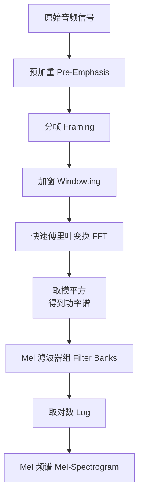

好的，很乐意为您详细介绍 Mel 频谱。

Mel 频谱是语音处理和音频分析中一个**极其重要且基础**的特征表示。可以说，它是连接原始音频信号和高级语音识别、音乐信息检索等应用之间的关键桥梁。

简单来说，**Mel 频谱是一种模拟人耳听觉特性的音频频谱表示方法。**

下面我们分步来详细解析它。

### 一、为什么需要 Mel 频谱？—— 核心动机

1.  **原始音频的缺陷**：原始的音频波形（时域信号）虽然包含了所有信息，但对于机器来说，它非常难以直接理解和处理。波形中的模式（如音色、音高）并不直观。
2.  **人耳听觉的非线性**：人耳对不同频率声音的感知不是线性的。我们对低频区域（如 100Hz 和 200Hz 的差别）的变化非常敏感，而对高频区域（如 10,000Hz 和 10,100Hz 的差别）的变化不那么敏感。这种感知尺度被称为 **Mel 尺度**。
3.  **计算效率与信息压缩**：直接从波形中学习需要巨大的计算量。我们需要一种能够保留关键信息（特别是对人类感知重要的信息），同时又能大幅降低数据复杂度的表示方法。

**Mel 频谱就是为了解决这些问题而设计的：它将线性频率刻度转换为更符合人耳听觉的 Mel 刻度，并保留了声音的频谱能量信息。**

---

### 二、Mel 频谱的计算步骤

计算 Mel 频谱通常包含以下几个关键步骤，其流程图可以清晰地展示这一过程：

#### 步骤 1：预加重
*   **目的**：提升高频分量。由于声音信号中通常高频能量较低，预加重可以平衡频谱，使其更接近人耳的感知特性，同时也有利于后续处理。
*   **方法**：使用一个高通滤波器。公式通常为：`y(t) = x(t) - α * x(t-1)`，其中 α 是一个接近 1 的常数（如 0.97）。

#### 步骤 2：分帧
*   **目的**：将连续的音频信号切分成短时片段（帧）。因为音频信号是快速变化的（非平稳信号），但在一个足够短的时间段内（如 20-40 ms），可以认为是稳定的（准平稳信号）。
*   **参数**：帧长（Frame Length）和帧移（Frame Shift）。帧移通常小于帧长，以保证帧与帧之间的连续性。

#### 步骤 3：加窗
*   **目的**：减少每一帧信号在两端的不连续性，避免后续做 FFT 时产生频谱泄露。
*   **方法**：将每一帧信号乘上一个窗函数（如汉明窗 Hamming Window）。

#### 步骤 4：快速傅里叶变换
*   **目的**：将每一帧的时域信号转换为频域信号，得到该帧的**频谱**。这能让我们看到在这一小段时间内，哪些频率的成分存在。
*   **结果**：得到的是线性频谱。

#### 步骤 5：Mel 滤波器组
*   **目的**：这是将线性频谱转换为 Mel 频谱的**核心步骤**。
*   **方法**：
    *   在 Mel 尺度上，设计一组三角形的带通滤波器（Mel滤波器组）。这些滤波器在低频区域密集（数量多、窄），在高频区域稀疏（数量少、宽）。
    *   将步骤 4 得到的线性频谱的**功率**（对 FFT 结果取模平方）通过这组 Mel 滤波器。
    *   每个滤波器会输出一个值，代表该频带内的总能量。
*   **效果**：通过这个步骤，我们将成千上万个线性频率点（来自 FFT）压缩成了几十个（如 40 或 80 个）Mel 频带能量值。这既模拟了人耳的听觉，也实现了数据的降维。

#### 步骤 6：取对数
*   **目的**：压缩动态范围，模仿人耳对声音响度的非线性感知（人耳对声音强度的感知也近似对数关系）。同时，这对后续的机器学习模型更友好。
*   **方法**：对每个 Mel 频带能量值计算其对数（log）。

最终，将所有帧的这些 Mel 频带对数能量组合起来，就形成了一个二维矩阵，这就是 **Mel 频谱图**。

*   **X 轴**：时间（每一帧对应一个时间点）
*   **Y 轴**：Mel 频带（频率，但已经是 Mel 尺度）
*   **Z 轴（颜色）**：对数能量值（颜色越亮，能量越强）

---

### 三、Mel 频谱图的特点

*   **感知驱动**：其频率尺度（Mel）和强度尺度（对数）都模拟了人耳的听觉特性。
*   **信息压缩**：它将高维的波形或线性频谱压缩为一个低维且信息密集的表示。
*   **可视化直观**：Mel 频谱图可以直观地展示音频的时频特性，例如元音的共振峰、辅音的爆破、音乐的旋律轮廓等。人类可以直接“看到”声音的一些模式。

---

### 四、Mel 频谱与 MFCC 的关系

MFCC 是 Mel 频谱的进一步处理结果，可以看作是 Mel 频谱的“浓缩精华”。

1.  首先，按照上述步骤计算出 Mel 频谱。
2.  然后，对 Mel 频谱的**每一帧**进行**离散余弦变换**。
3.  DCT 的作用是解相关，并将信息压缩到少数几个系数上。保留前 12-13 个系数，就得到了 MFCC。

**简单比喻**：
*   **Mel 频谱** 就像是描述了声音的“频谱包络”的形状。
*   **MFCC** 则是描述这个形状的“关键参数”。

在深度学习兴起之前，MFCC 因其更小的数据量和更好的性能，是语音识别的绝对主流特征。而如今，**Mel 频谱本身作为深度学习模型的输入变得更加流行**，因为深度神经网络可以自动从 Mel 频谱中学习到比 MFCC 更丰富、更任务相关的特征。

---

### 五、主要应用场景

1.  **自动语音识别**：是 CNN、RNN、Transformer 等模型的标准输入特征。
2.  **音乐信息检索**：如流派分类、乐器识别、和弦检测、节拍跟踪等。
3.  **语音合成**：如 Tacotron 等模型，根据 Mel 频谱来生成语音波形。
4.  **声音事件检测**：如识别环境音、枪声、玻璃破碎声等。
5.  **说话人识别/验证**：虽然 MFCC 也常用，但 Mel 频谱同样有效。

### 总结

**Mel 频谱**是一种基于人耳听觉心理声学模型的时频特征表示。它通过**预加重、分帧、加窗、FFT、Mel滤波器组、取对数**等一系列步骤，将原始音频信号转换为一个既能保留关键声学信息，又符合人类感知特性的二维图像（频谱图）。它是现代音频和语音处理领域不可或缺的基础工具。

好的，下面我将给出 Mel 频谱的严格数学定义，涵盖从原始信号到最终 Mel 频谱的完整数学推导。

## 1. 信号预处理

### 1.1 预加重
原始音频信号 $x[n]$ 经过预加重滤波器：
$$y[n] = x[n] - \alpha x[n-1]$$
其中 $\alpha \in [0.9, 0.97]$，通常取 0.97。

### 1.2 分帧
将信号分为重叠的帧：
$$y_m[l] = y[m \cdot H + l], \quad l = 0, 1, \ldots, L-1$$
其中：
- $m$ 是帧索引
- $L$ 是帧长（通常对应 20-40ms）
- $H$ 是帧移（通常为 $L/2$）

### 1.3 加窗
对每帧应用窗函数：
$$s_m[l] = y_m[l] \cdot w[l]$$
常用的汉明窗定义为：
$$w[l] = 0.54 - 0.46 \cos\left(\frac{2\pi l}{L-1}\right), \quad l = 0, 1, \ldots, L-1$$

## 2. 频谱分析

### 2.1 短时傅里叶变换
对加窗后的帧进行离散傅里叶变换：
$$X_m[k] = \sum_{l=0}^{L-1} s_m[l] e^{-j2\pi kl/N}, \quad k = 0, 1, \ldots, N-1$$
其中 $N \geq L$ 是 DFT 点数（通常为零填充到 2 的幂次）。

### 2.2 功率谱计算
计算周期图功率谱估计：
$$P_m[k] = \frac{1}{N} |X_m[k]|^2$$

## 3. Mel 尺度变换

### 3.1 Mel 频率尺度定义
赫兹频率 $f$ 到 Mel 频率 $m$ 的转换：
$$m = 2595 \log_{10}\left(1 + \frac{f}{700}\right)$$
逆变换：
$$f = 700 \cdot (10^{m/2595} - 1)$$

### 3.2 Mel 滤波器组设计
定义 $M$ 个三角滤波器组成的滤波器组 $\{H_m[k]\}_{m=1}^M$：

对于第 $m$ 个滤波器 ($1 \leq m \leq M$)：
$$
H_m[k] = 
\begin{cases}
0 & \text{当 } f[k] < f[m-1] \\
\dfrac{f[k] - f[m-1]}{f[m] - f[m-1]} & \text{当 } f[m-1] \leq f[k] < f[m] \\
\dfrac{f[m+1] - f[k]}{f[m+1] - f[m]} & \text{当 } f[m] \leq f[k] < f[m+1] \\
0 & \text{当 } f[k] \geq f[m+1]
\end{cases}
$$

其中边界频率 $f[m]$ 在 Mel 尺度上等间距选取：
$$m_{\text{mel}}[i] = m_{\text{mel}}^{\min} + \frac{i}{M+1}(m_{\text{mel}}^{\max} - m_{\text{mel}}^{\min})$$
然后转换回赫兹尺度：
$$f[i] = 700 \cdot (10^{m_{\text{mel}}[i]/2595} - 1)$$

## 4. Mel 频谱计算

### 4.1 滤波器组应用
将功率谱通过 Mel 滤波器组：
$$E_m[i] = \sum_{k=0}^{N/2} P_m[k] \cdot H_i[k], \quad i = 1, 2, \ldots, M$$
其中求和通常只取正频率部分 $k = 0$ 到 $N/2$。

### 4.2 对数压缩
对滤波器组输出取对数：
$$\text{MelSpectrogram}[m, i] = \log(E_m[i] + \epsilon)$$
其中 $\epsilon$ 是小常数（如 $10^{-6}$）防止数值问题。

## 5. 完整数学定义

**Mel 频谱**是一个从离散时间信号 $x[n]$ 到时频表示 $\mathbf{S} \in \mathbb{R}^{T \times M}$ 的映射：

$$\mathbf{S}[t, i] = \log\left( \sum_{k=0}^{N/2} \left| \text{DFT}_N\left\{ x[tH + l] \cdot w[l] \right\}[k] \right|^2 \cdot H_i[k] + \epsilon \right)$$

其中：
- $t$: 时间帧索引
- $i$: Mel 频带索引 ($1 \leq i \leq M$)
- $H$: 帧移
- $w[l]$: 窗函数
- $H_i[k]$: 第 $i$ 个 Mel 滤波器响应
- $\text{DFT}_N$: $N$ 点离散傅里叶变换

## 6. 参数选择典型值

| 参数         | 典型值  | 说明             |
| ------------ | ------- | ---------------- |
| 采样率       | 16 kHz  | 语音常用         |
| 帧长         | 25 ms   | $L = 400$ 样本   |
| 帧移         | 10 ms   | $H = 160$ 样本   |
| FFT 点数     | 512     | $N = 512$        |
| Mel 滤波器数 | 40-80   | $M = 40$         |
| 频率范围     | 0-8 kHz | 覆盖语音主要能量 |

这个数学定义提供了从原始信号到 Mel 频谱的完整、严格的变换过程，是音频处理算法实现的基础。