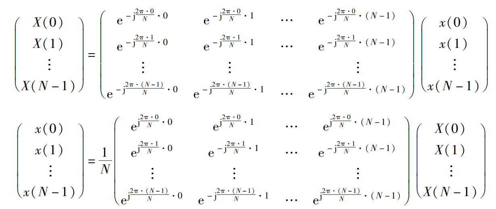

## 定义
离散 Fourier 变换（DFT）将长度为 $N$ 的**离散时域序列** $\{x[n]\}_{n=0}^{N-1}$ 转换为**离散频域序列** $\{X[k]\}_{k=0}^{N-1}$，定义式为：
$$
X[k] = \sum_{n=0}^{N-1} x[n] \cdot e^{-j \frac{2\pi}{N} kn}, \quad k = 0,1,\dots,N-1
$$
其中：
- $j = \sqrt{-1}$ 是虚数单位
- $e^{-j\theta} = \cos\theta - j\sin\theta$（欧拉公式）

**逆变换**定义为：

$$
x[n] = \frac{1}{N} \sum_{k=0}^{N-1} X[k] \cdot e^{j \frac{2\pi}{N} kn}, \quad n = 0,1,\dots,N-1
$$

对比连续周期（$=N$）函数的 Fourier 变换：
$$
\hat f (k) = \int_{0}^{N}f(n)\cdot e^{-j\frac{2\pi}{N}kn}\,dn.
$$

离散 Fourier 变换相当于对上述积分采用矩形积分法进行数值近似。

【n维空间的 DFT】
对于 $d$ 维离散序列 $x[n_1,n_2,\cdots,n_d]$，其 DFT 定义为：
$$
X[k_1,k_2,\cdots,k_d] 
= \sum_{n_1=0}^{N_1-1} \sum_{n_2=0}^{N_2-1} \cdots \sum_{n_d=0}^{N_d-1} x[n_1,n_2,\cdots,n_d] \cdot e^{-j 2\pi \left(\frac{k_1 n_1}{N_1} + \frac{k_2 n_2}{N_2} + \cdots + \frac{k_d n_d}{N_d}\right)}
$$

其中 $N_i$ 是第 $i$ 维的长度，$k_i = 0,1,\cdots,N_i-1$.

这相当于对每一维分别进行一维 DFT。

逆变换为：
$$
x[n_1,n_2,\cdots,n_d] = \frac{1}{N_1 N_2 \cdots N_d} \sum_{k_1=0}^{N_1-1} \sum_{k_2=0}^{N_2-1} \cdots \sum_{k_d=0}^{N_d-1} X[k_1,k_2,\cdots,k_d] \cdot e^{j 2\pi \left(\frac{k_1 n_1}{N_1} + \frac{k_2 n_2}{N_2} + \cdots + \frac{k_d n_d}{N_d}\right)}
$$

如果我们记 $\mathbf n = (n_1,\cdots,n_d),\,\mathbf k = (k_1,\cdots,k_d),\,\mathbf N = (N_1,\cdots,N_d)$，利用逐分量除法记号

$$
\frac{\mathbf n}{\mathbf N} := \left( \frac{n_1}{N_1}, \ldots, \frac{n_d}{N_d} \right)
$$

我们可以将 DFT 简写为

$$
X[\mathbf k] = \sum_{\mathbf n \in D} x[\mathbf n] e^{-j 2\pi \frac{\mathbf n}{\mathbf N} \cdot \mathbf k}
$$

其中 $D$ 代表所有离散点的集合。

逆变换为：

$$
x[\mathbf n] = \frac{1}{\prod_{i=1}^d N_i} \sum_{\mathbf k \in \bar D} X[\mathbf k] e^{j 2\pi \frac{\mathbf k}{\mathbf N} \cdot \mathbf n}
$$

其中 $\bar D$ 代表所有频域点的集合。

进一步，如果假设 $\mathbf x(\mathbf n) = (x_1(\mathbf n),\cdots,x_m(\mathbf n))$，则其傅里叶变换为

$$
\mathbf X(\mathbf k) = \left( \begin{array}{c}
X_1(k_1,\cdots,k_d) \\
\vdots \\
X_m(k_1,\cdots,k_d)
\end{array} \right)
$$

## 关键性质

### 1. 线性性
 $a \cdot x[n] + b \cdot y[n] \leftrightarrow a \cdot X[k] + b \cdot Y[k]$

---
下面我们用 $(n)_N$ 表示整数 $n$ 对 $N$ 取模。其结果是 $n$ 除以 $N$ 后的非负余数，这个余数总是在区间 $[0, N-1]$ 内。例如，$(-1)_N=N-1.$

对于两个具有相同长度 $N$ 的序列 $x[n]$ 和 $y[n]$，它们的循环卷积定义为：
$$(x \circledast y)[n] = \sum_{m=0}^{N-1} x[m] \cdot y[(n-m)_N],\,\,n=0,1,\cdots, N-1.$$

其中 $(n-m)_N$ 就是上面介绍的模运算。循环卷积相当于把卷积的右边一项（$y[n]$）延拓成周期序列。它等价于
$$
(x \circledast y)[n] = \sum_{m=0}^{n} x[m] \cdot y[n-m]+ \sum_{m=n+1}^{N-1} x[m] \cdot y[N+n-m].
$$

其中 $0\leq n \leq N-1$.

循环卷积具有**线性性、交换律、结合律**。

---

### 2. 循环移位性

*   **时域循环移位**: $x[(n-m)_N] \leftrightarrow e^{-j \frac{2\pi}{N}km} X[k]$
  
*   **频域循环移位**: $e^{j \frac{2\pi}{N}kn} x[n] \leftrightarrow X[(k-l)_N]$

### 3. 对偶性

* 若 $x[n] \leftrightarrow X[k]$，则 $X[n] \leftrightarrow N \cdot x[(-k)_N]$

### 4. 对称性

*  $X[k] = X^*[(-k)_N]$，其中 $X^*$ 表示复共轭。
*   **推论**:
    *   幅值频谱是偶对称: $|X[k]| = |X[N-k]|$ （对于 $k=1,2,...,N-1$）
    *   相位频谱是奇对称: $\angle X[k] = -\angle X[N-k]$

### 5. 循环卷积定理

*   **时域循环卷积**: $x[n] \circledast y[n] \leftrightarrow X[k] \cdot Y[k]$
    *   其中 $\circledast$ 表示**循环卷积**，$\cdot$ 表示逐分量乘法，即 $X[k]\cdot Y[k]= (X[0]Y[0],\cdots,X[N-1]Y[N-1])$.
*   **频域循环卷积**: $x[n] \cdot y[n] \leftrightarrow \frac{1}{N} X[k] \circledast Y[k]$

通过DFT可以计算两个序列的卷积。具体步骤是：对两个序列补零至长度 $L \geq N_x + N_y - 1$，计算它们的DFT并相乘，然后对结果做IDFT。利用FFT算法可以极大地加速卷积计算，其复杂度为 $O(L \log L)$.

### 6.  Parseval 定理

*   **描述**: 信号在时域的总能量等于其在频域的总能量。
*   **数学表达**: $\sum_{n=0}^{N-1} |x[n]|^2 = \frac{1}{N} \sum_{k=0}^{N-1} |X[k]|^2$
*   **意义与应用**:
    *   **能量守恒**: 这一定理保证了信号从时域变换到频域后，其能量保持不变。
    *   **频谱分析**: $|X[k]|^2$ 定义为**功率谱**，它直接反映了信号能量在不同频率成分上的分布情况，是频谱分析的核心概念。

### 7. 频域微分

*   **描述**: 通过DFT可以方便地计算信号的导数。
*   **数学表达**: $n \cdot x[n] \leftrightarrow j \frac{N}{2\pi} \frac{d}{dk} X[k]$ （这是一个近似表达，更精确的形式涉及周期序列的 Fourier 级数）
*   **意义与应用**: 在需要计算信号导数或解微分方程的场合，可以转到频域进行乘法操作，然后再变换回时域，这有时比直接数值微分更高效、更准确。

---

### 总结表

为了更清晰地对比，我们将主要性质总结如下：

| 性质              | 时域序列                   | 频域序列                            |
| :---------------- | :------------------------- | :---------------------------------- |
| **线性性**        | $a x[n] + b y[n]$          | $a X[k] + b Y[k]$                   |
| **时域循环移位**  | $x[(n-m)_N]$               | $e^{-j(2\pi k m / N)} X[k]$         |
| **频域循环移位**  | $e^{j(2\pi l n / N)} x[n]$ | $X[(k-l)_N]$                        |
| **时域循环卷积**  | $x[n] \circledast y[n]$    | $X[k] \cdot Y[k]$                   |
| **时域相乘**      | $x[n] \cdot y[n]$          | $\frac{1}{N} X[k] \circledast Y[k]$ |
| **Parseval 定理** | $\sum \|x[n]\|^2$          | $\frac{1}{N} \sum \|X[k]\|^2$       |

这些性质共同构成了离散 Fourier 变换的理论框架，使其成为数字信号处理中不可或缺的工具。

# 离散 Fourier 变换的 Hilbert 空间描述

## 基本框架
在有限维 Hilbert 空间 $\mathbb{C}^N$ 中，离散 Fourier 变换（DFT）可视为基变换操作。标准正交基为 $\{\mathbf{e}_n\}_{n=0}^{N-1}$（时域基），Fourier 基定义为：
$$
\mathbf{f}_k = \frac{1}{\sqrt{N}} \left(1, e^{-2\pi i k/N}, \ldots, e^{-2\pi i k(N-1)/N}\right)^T
$$
该基满足 $\langle \mathbf{f}_k, \mathbf{f}_l \rangle = \delta_{kl}$，构成 $\mathbb{C}^N$ 的完备正交基。

## 变换的幺正性

DFT 矩阵 $F$ 的元素为 $F_{kn} = \frac{1}{\sqrt{N}} e^{-2\pi i kn/N}$，满足：
$$
F^\dagger F = I
$$
表明 DFT 是 Hilbert 空间上的**幺正算子**。信号 $\mathbf{x}$ 的变换 $\mathbf{X} = F\mathbf{x}$ 保持内积不变：
$$
\langle \mathbf{x}, \mathbf{y} \rangle = \langle \mathbf{X}, \mathbf{Y} \rangle
$$

## 谱分解视角
DFT 实现信号的**谱分解**：
$$
\mathbf{x} = \sum_{k=0}^{N-1} \langle \mathbf{f}_k, \mathbf{x} \rangle \mathbf{f}_k
$$
系数 $\langle \mathbf{f}_k, \mathbf{x} \rangle$ 对应频率分量幅度，投影算子 $P_k = \mathbf{f}_k \mathbf{f}_k^\dagger$ 提取第 $k$ 个频率分量。

## 卷积定理
在 Hilbert 空间中，卷积算子 $C$ 与 DFT 对易：
$$
F(C\mathbf{x}) = \operatorname{diag}(\mathbf{H}) F\mathbf{x}
$$
其中 $\mathbf{H}$ 为系统的频率响应，体现了 Fourier 基是卷积算子的**特征向量基**。

## 不确定性原理
DFT 体现了时频不确定性：信号在时域和频域的能量分布满足
$$
\Delta t \cdot \Delta \omega \geq \frac{1}{2}
$$
其中 $\Delta t$ 和 $\Delta \omega$ 分别为时域和频域的标准差，反映信号无法同时在时域和频域高度集中。

## 算子范数
DFT 矩阵的**谱范数** $\|F\|_2 = 1$，保证变换过程中信号能量的守恒（Parseval 定理）。

